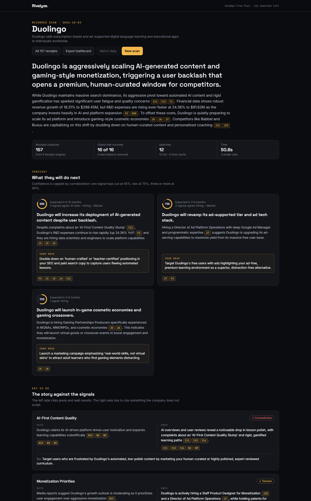

# Rivalyze

**Read what your rivals can't hide.**

A company scripts its press releases. It can't script what it hires for, what it patents, which ads it buys, how search demand for it moves, or what people ask about it. Those are involuntary signals, and every one of them shows up in search data.

Rivalyze collects them through SerpApi, sets them against the company's official story, and forecasts its next move. Every claim in a report links to the search result behind it. A claim that can't cite one is deleted before you see it.



## What you get

Type a competitor's name. In about a minute you get:

- **Forecasts.** Specific, falsifiable moves the company is likely to make, each with a horizon, a confidence score and a counter-move you can start this week.
- **Say vs do.** What the press coverage claims next to what hiring, patents, ads and demand actually show, marked consistent, tension or contradiction.
- **Tells.** Findings grouped by signal, each with its receipts.
- **Numbers.** Twelve months of search demand against rivals, hiring mix by function, patent activity, ad creatives and financials. These are computed in code from the search results, not estimated by the model.
- **Standing.** A scorecard of the company against its rivals on search demand, demand momentum, fresh job postings, patents on file and recent filings, with its rank on each and a plain list of where it is ahead and where a rival is. Rivals are chosen from what people type after "*company* vs" in Google. The ranks and the ahead/behind statements are written by code from the numbers, so they can't overclaim.
- **Ask.** Follow-up questions answered from the scan's evidence, with live searches when the evidence falls short.
- **Battlecard export** as a print-ready PDF or Markdown, and a **watchlist** that rescans daily and lists what changed.

Examples from the recorded scans in this repo:

| Company | What the signals showed |
|---|---|
| Figma | Second of five on search demand, far behind Canva (5.6 against 74.7 on Google's index), first on fresh job postings, and repositioning from design canvas to AI coding platform. |
| Duolingo | Postings for "Gaming Partnerships Producers" with cosmetic-economy experience and a Director of Ad Platform Operations, while R&D spend grows faster than revenue. Forecast: in-game cosmetics and a rebuilt ad tier. |
| Notion | Press coverage says "AI agent platform". Hiring says Android mobile core and offline reliability. Notion shut down its email client while holding a June 2025 patent on backend email systems. |
| Tesla | Patents concentrate on battery chemistry and vision-only autonomy while R&D expenses climb and search interest in BYD rises. |

## Try it without any API key

Four real scans are recorded in `backend/demos/`. They replay step by step and spend no searches.

```bash
git clone https://github.com/inslot2525-ctrl/Rivalyze
cd Rivalyze

# backend
cd backend
python -m venv .venv
.venv\Scripts\activate          # macOS/Linux: source .venv/bin/activate
pip install -r requirements.txt
uvicorn main:app --port 8000

# frontend, in a second terminal
cd frontend
npm install
npm run dev
```

Open http://localhost:5173 and pick a recorded scan. Reports have shareable addresses, for example `http://localhost:5173/#/scan/demo:duolingo`.

For live scans, copy `backend/.env.example` to `backend/.env` and set:

```
SERPAPI_API_KEY=...   # https://serpapi.com/manage-api-key
GEMINI_API_KEY=...    # https://aistudio.google.com/apikey
```

Requires Python 3.10+ and Node 18+.

## How SerpApi is used

Nine engines, each feeding one signal. Remove search and there is no product: the model is only allowed to reason over what these calls return.

| Engine | Signal | What Rivalyze takes from it |
|---|---|---|
| `google_autocomplete` | Rivals | Completions of "*company* vs", a crowd-sourced competitor list |
| `google` | Web, doubts, AI view | Organic results, People Also Ask, related searches and the AI Overview from a single call |
| `google_jobs` | Hiring | Live postings, filtered to the employer and classified by function, location and age |
| `google_news` | Narrative | Coverage, used as the "says" side |
| `google_trends` | Demand | One call comparing the company and up to four rivals on the same scale |
| `google_patents` | R&D | Newest filings by assignee and the CPC class breakdown |
| `google_ads_transparency_center` | Ad spend | Creatives bought by the company's own entities, by format and launch date |
| `google_finance` | Market | Price, key stats and the latest income statement for public companies |
| `google_ai_mode` | AI view | How an AI answer describes the company, with its sources |

The **Ask** agent reaches SerpApi through the [hosted SerpApi MCP server](https://serpapi.com/integrations/mcp) (`mcp.serpapi.com`), falling back to the Python client if the MCP call fails.

### Spending searches carefully

Rivalyze was built on a free SerpApi plan, so the search budget is part of the design:

- Every response is cached on disk by a hash of the engine and parameters, with a freshness window per engine (12 hours for news, 14 days for patents).
- The research plan for a company is cached too, so a rescan issues the same queries and hits the cache.
- A scan has a hard budget (`SCAN_SEARCH_BUDGET`, default 15). A typical first scan uses 13 or 14 searches; a repeat uses 0 to 3.
- With no key set, the app runs in replay mode: cached searches and recorded demos still work.
- The header shows your remaining searches, read from SerpApi's free account endpoint.

## How a scan works

```
          SerpApi                      Gemini                     plain code
 ┌──────────────────────┐   ┌──────────────────────────┐   ┌─────────────────────┐
 │ 1 Scout              │   │ 2 Plan                   │   │                     │
 │   autocomplete, web  │──▶│   entity, rivals, queries│   │                     │
 │ 3 Collect (parallel) │◀──│                          │   │                     │
 │   jobs, news, trends,│   │                          │   │ analytics: hiring   │
 │   patents, ads,      │──────────────────────────────────▶ mix, trend change,  │
 │   finance            │   │ 4 Critique               │   │ patents, ads        │
 │ 5 Follow up          │◀──│   gaps + up to 3 searches│◀──│                     │
 │   whatever it asked  │   │ 6 Analyse                │   │ 7 Ground            │
 │   for                │──▶│   tells, say-vs-do,      │──▶│   drop uncited      │
 │                      │   │   forecasts, all cited   │   │   claims, cap       │
 └──────────────────────┘   └──────────────────────────┘   │   confidence        │
                                                           └─────────────────────┘
                 every step streams to the browser over server-sent events
```

1. **Scout** finds the company and the names people compare it to.
2. **Plan** resolves the legal entity, domain, ticker, rivals (with the employer behind each product) and a news query that survives name collisions.
3. **Collect** runs the signal searches in parallel. Each collector turns a response into evidence items with stable ids such as `J3` (a job posting) or `P7` (a patent).
4. **Critique** reads the evidence and asks for up to three more searches that would sharpen or test a forecast.
5. **Follow up** runs them.
6. **Analyse** writes tells, say-vs-do items and forecasts. Every one must cite evidence ids.
7. **Ground** is not a model. It checks each citation against the evidence store, removes ids that don't exist, and drops any claim left with nothing behind it. A say-vs-do item is dropped unless its "does" side cites an involuntary signal. Forecast confidence is capped by corroboration: 55% for one signal, 75% for two, 90% for three or more.

The report shows how many claims were checked and how many survived.

## Use it from Claude or any MCP client

Rivalyze is also an MCP server, with tools `scan_company`, `list_demos`, `get_battlecard`, `get_tells` and `ask_about_scan`.

```bash
claude mcp add rivalyze -- /path/to/Rivalyze/backend/.venv/bin/python /path/to/Rivalyze/backend/mcp_server.py
```

On Windows the interpreter is `backend\.venv\Scripts\python.exe`.

## From the terminal

```bash
cd backend
python scan_cli.py "Figma"              # prints the trace and the findings
python scan_cli.py "Figma" --save-demo  # also records it as a replayable demo
```

## API

| Route | Purpose |
|---|---|
| `GET /scan/stream?company=&rivals=` | Run a scan; server-sent events ending with the report |
| `GET /demos`, `GET /demos/{slug}/stream` | Recorded scans and their replay |
| `GET /scans`, `GET /scans/{id}` | Saved reports (`demo:<slug>` works as an id) |
| `GET /scans/{id}/battlecard.md` | Markdown export |
| `POST /ask` | Follow-up question about a scan |
| `GET/POST/PATCH/DELETE /monitor` | Watchlist with scheduled rescans |
| `GET /usage`, `GET /health` | SerpApi quota and configuration status |

Interactive docs are at http://localhost:8000/docs.

## Tests

```bash
cd backend
pytest
```

Twenty-two tests run offline against recorded SerpApi responses in `backend/tests/fixtures`. They cover the cache and budget, each collector, the analytics, the scorecard, the grounding rules and a full scan with a stubbed model.

## Project layout

```
backend/
  main.py              FastAPI app: scan stream, demos, ask, watchlist
  agents/pipeline.py   the seven-stage scan
  agents/grounding.py  citation checks and confidence caps
  agents/ask.py        follow-up agent, live search through SerpApi MCP
  agents/schemas.py    evidence and structured-output models
  serp/client.py       cached, budgeted SerpApi client
  serp/collectors.py   one normaliser per engine
  analytics.py         numbers computed from search results
  storage.py           saved scans, scan-to-scan diff, demos
  battlecard.py        Markdown export
  mcp_server.py        Rivalyze as an MCP server
  demos/               recorded scans
  tests/               offline tests and fixtures
frontend/
  src/App.jsx          landing, live trace and report views
  src/components/      report sections, charts, receipts drawer, ask panel
```

## Limits

- Google Jobs returns about ten postings per search. Hiring findings describe the mix of a sample, not a headcount, and the report says so.
- A rival whose postings can't be matched to an employer is left out of the hiring comparison rather than shown as zero. The same goes for patents when a short name such as "Coda" matches several unrelated owners.
- Hiring and patent figures for a product belong to the company behind it (Adobe for Adobe XD), and the scorecard says so.
- Google Trends terms that are also common words ("Notion", "Coda") include unrelated searches.
- Forecasts are inferences from public signals. The receipts are there so you can check them.

## Stack

FastAPI, SQLite, APScheduler and the official `serpapi` and `mcp` Python packages on the backend; Gemini for the three model steps; React, Vite, Tailwind and Recharts on the frontend.

## License

MIT
